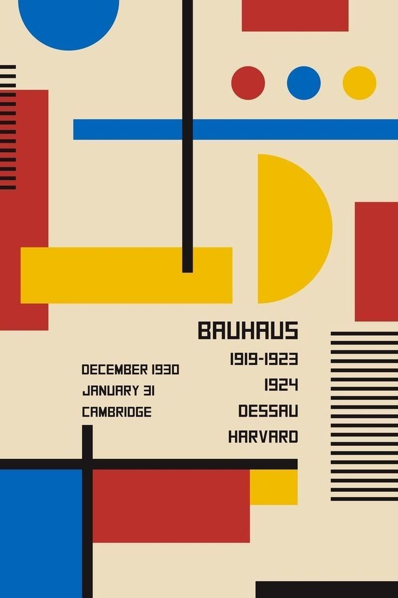
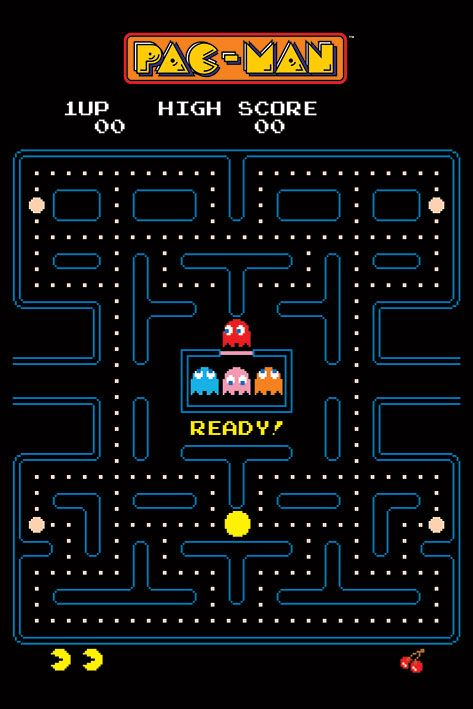
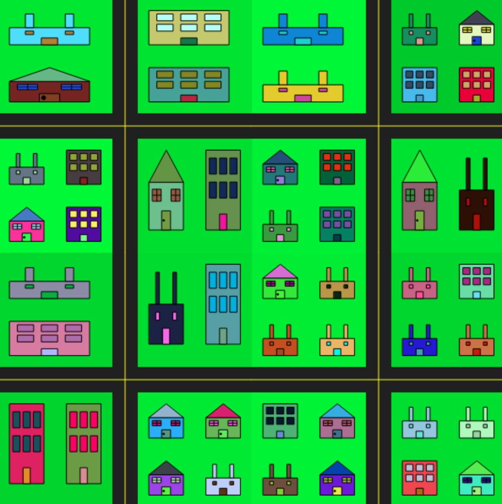

# jili0934_9103_tut07_quiz8_week9
### Part 1: Imaging Technique Inspiration
I am inspired by imaging techniques that combine bright primary colours, geometric shapes, with grid-based layout. This kind of visual style provides me with a strong sense of rhythm and structure, which is visually engaging the audience. I would like to incorporate these elements into my major project by using coloured geometric shapes and a grid-based layout to create an artwork with a contemporary style. To achieve the visual approach, I plan to use functions in p5.js, which allows me to build well-structured, animated and interactive artwork.
#### Bauhaus
1. Geometric shapes
2. Bright primary colours
3. Minimalist composition

###### [Retrieved from Pinterest](https://au.pinterest.com/pin/4855512094371380/)

#### Pac-Man
1. Grid-based layout
2. Bright primary colours
3. Repetitive graphic elements

###### [Retrieved from Pinterest](https://au.pinterest.com/pin/785385622533868384/)

### Part 2: Coding Technique Exploration
###### [Happy coding: drawCity](https://happycoding.io/tutorials/p5js/creating-functions/city)
The draw City function from happy coding could assist me in implementing the geometric shapes, bright primary colours and grid-based layout technique I selected for my part 1: Imaging Technique Inspirations. The draw City function uses coding techniques to build grid-based layout city patterns. By using functions such as draw City() and drawBlock(), I can repeatedly draw primary colour geometric shapes and blocks with a grid-based layout. The draw City function has a clear structure and it’s easy to reuse. This draw City function also provides a simple composition similar to the maze layout in Pac-Man and the visual style of Bauhaus.

